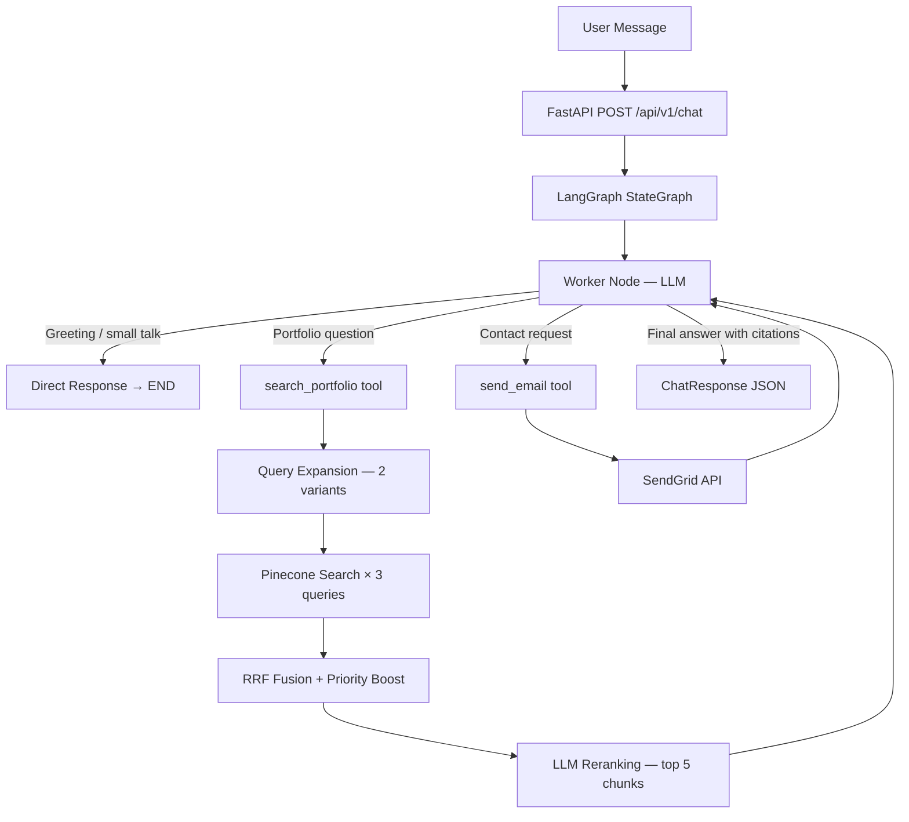

# Portfolio RAG Chatbot


A RAG-powered AI chatbot for [Shashikar Anthoni Raj's portfolio](https://shashikaranthoniraj.netlify.app/). Visitors can ask natural-language questions about his skills, projects, and experience — or send a contact email — all through a single conversational interface.

---

## Architecture



---

## Tech Stack

| Layer | Technology |
|---|---|
| API | FastAPI + SlowAPI rate limiting |
| Orchestration | LangGraph (StateGraph + ToolNode + SqliteSaver) |
| LLM | GPT-5 nano via `langchain-openai` |
| Embeddings | `text-embedding-3-small` |
| Vector DB | Pinecone (serverless, free tier) |
| Email | SendGrid |
| Persistence | SQLite (LangGraph conversation checkpoints) |
| Package Manager | uv |

---

## Setup

### Prerequisites

- Python 3.13+
- [uv](https://docs.astral.sh/uv/) — install with `curl -LsSf https://astral.sh/uv/install.sh | sh`
- OpenAI API key
- Pinecone API key (free tier works)
- SendGrid API key (for email feature)

### 1. Clone and install

```bash
git clone https://github.com/shashikar-anthoniraj/portfolio-rag-chatbot.git
cd portfolio-rag-chatbot
uv sync
```

### 2. Configure environment

```bash
cp .env.example .env
# Fill in your API keys in .env
```

### 3. Ingest portfolio data

Embeds all markdown files in `data/raw/` and upserts them to Pinecone:

```bash
uv run python scripts/ingest.py
```

### 4. Run the API

```bash
uv run uvicorn app.main:app --reload
```

API: `http://localhost:8000`
Swagger UI: `http://localhost:8000/docs`

---

## API Endpoints

### `POST /api/v1/chat`

Send a message. Pass the same `thread_id` across requests to maintain conversation history.

```bash
curl -X POST http://localhost:8000/api/v1/chat \
  -H "Content-Type: application/json" \
  -d '{"message": "What are Shashikar'\''s skills?", "thread_id": "session-1"}'
```

**Response:**

```json
{
  "response": "Shashikar is proficient in Python, FastAPI, React, AWS, and more...",
  "thread_id": "session-1",
  "sources": [
    {
      "document": "11_technical_skills.md",
      "chunk": "Python, FastAPI, React, Spring Boot, AWS...",
      "relevance_score": 0.92
    }
  ],
  "email_sent": false
}
```

### `GET /api/v1/health`

```bash
curl http://localhost:8000/api/v1/health
# {"status": "ok"}
```

### `GET /api/v1/graph/image`

Returns the LangGraph workflow as a PNG image.

```bash
curl http://localhost:8000/api/v1/graph/image --output graph.png
```

---

## Docker (Local Testing)

```bash
# Build and run
docker compose up --build

# API available at http://localhost:8000
```

---

## Development

```bash
# Run tests
uv run pytest -v

# Lint
uv run ruff check .

# Manual integration tests (requires real API keys)
uv run python scripts/test_rag.py
uv run python scripts/test_graph.py
```

---

## Project Structure

```
portfolio-rag-chatbot/
├── app/
│   ├── main.py                 # FastAPI app, CORS, lifespan, global error handler
│   ├── config.py               # pydantic-settings (loads .env)
│   ├── api/
│   │   └── routes.py           # POST /chat, GET /health, GET /graph/image
│   ├── graph/
│   │   ├── builder.py          # LangGraph StateGraph compilation
│   │   ├── worker.py           # LLM node with bound tools
│   │   └── tools.py            # search_portfolio + send_email tools
│   ├── models/
│   │   ├── schemas.py          # ChatRequest, ChatResponse, Source
│   │   └── state.py            # LangGraph State TypedDict
│   ├── rag/
│   │   ├── query_expansion.py  # LLM query variant generation
│   │   ├── retriever.py        # Pinecone search + RRF fusion
│   │   └── reranker.py         # LLM relevance scoring
│   ├── services/
│   │   ├── llm_service.py      # OpenAI chat + embeddings wrapper
│   │   └── email_service.py    # SendGrid wrapper
│   └── utils/
│       └── prompts.py          # Worker system prompt
├── scripts/
│   ├── ingest.py               # Data ingestion pipeline
│   ├── test_rag.py             # Manual RAG pipeline test
│   └── test_graph.py           # Manual graph end-to-end test
├── tests/
│   ├── conftest.py             # Fixtures (mocked client)
│   └── test_api.py             # API endpoint unit tests
├── data/
│   └── raw/                    # Portfolio markdown source files
├── Dockerfile
├── docker-compose.yml
├── pyproject.toml
└── .env.example
```
