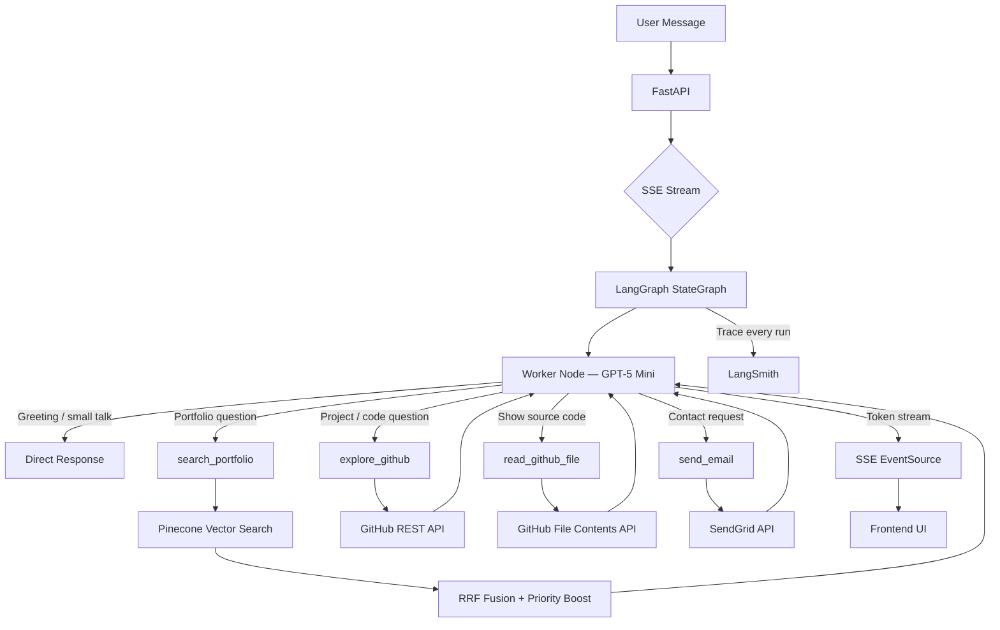

# Portfolio RAG Chatbot


A production-grade **multi-agent RAG chatbot** powering [Shashikar Anthoni Raj's portfolio](https://shashikaranthoniraj.netlify.app). Visitors can ask natural language questions about skills, projects, and experience — explore live GitHub repositories and source code — or send a contact email — all through a real-time streaming conversational interface.

Built with **LangGraph** agentic orchestration, **RAG with RRF fusion**, **live GitHub API integration**, and **SSE token-by-token streaming** with disconnect detection and automatic checkpoint recovery.

---

## Key Features

- **Real-time SSE Streaming** — Token-by-token response streaming with live thinking indicators and tool call notifications
- **Live GitHub Integration** — Explores repos, reads source code, analyzes project architecture in real-time via GitHub REST API
- **Advanced RAG Pipeline** — RRF fusion, priority boosting, and citation tracking over Pinecone vector search
- **Multi-Tool Agent** — LangGraph orchestrates 4 tools: portfolio search, GitHub explorer, file reader, and email sender
- **Disconnect Recovery** — Detects client disconnects mid-stream, cleans up corrupted checkpoints, and signals the frontend to reset
- **Persistent Memory** — SQLite-backed conversation history with thread-based checkpointing
- **LangSmith Observability** — Full tracing of every LLM call, tool invocation, token usage, latency, and RAG retrieval quality across all conversations
- **Zero Cold Starts** — UptimeRobot pings the health endpoint every 5 minutes, keeping the Render instance permanently warm

---

## Live Demo

Embedded on the portfolio site: [shashikaranthoniraj.netlify.app](https://shashikaranthoniraj.netlify.app)

Backend API: [portfolio-rag-chatbot-x19x.onrender.com](https://portfolio-rag-chatbot-x19x.onrender.com/api/v1/health)

---

## Architecture



---

## RAG Pipeline

| Technique | Description |
|-----------|-------------|
| **Multi-Query Retrieval** | Original query + expanded variants searched in parallel against Pinecone |
| **RRF Fusion** | Reciprocal Rank Fusion merges and re-ranks results across all queries |
| **Priority Boost** | Recent and high-importance documents get a configurable relevance boost |
| **Citation Tracking** | Every response includes source document names and relevance scores |

---

## Observability — LangSmith

Every request is fully traced end-to-end via **LangSmith**, giving production-level visibility into the entire agent pipeline:

| What's Tracked | Details |
|---|---|
| **LLM calls** | Input/output, model, token counts (prompt + completion), latency per call |
| **Tool invocations** | Which tool was called, arguments, execution time, result |
| **RAG retrieval** | Query variants, retrieved chunks, relevance scores, RRF fusion results |
| **Agent traces** | Full LangGraph run trace — every node, edge, and state transition |
| **Cost tracking** | Per-conversation token usage mapped to OpenAI pricing |
| **Error tracing** | Failed tool calls, LLM errors, and thread corruption events captured with full context |

LangSmith tracing is enabled via `LANGCHAIN_TRACING_V2=true` and `LANGCHAIN_API_KEY` in the environment — zero code changes required, LangGraph instruments automatically.

---

## SSE Streaming Events

The `/api/v2/chat/stream` endpoint emits structured SSE events for rich frontend rendering:

| Event | Description |
|-------|-------------|
| `thinking` | Processing status updates ("Using search_portfolio...") |
| `token` | Individual response tokens for real-time text rendering |
| `tool_call` | Tool invocation notification with tool name |
| `tool_result` | Tool execution result preview |
| `sources` | RAG source documents with relevance scores |
| `email_status` | Email delivery confirmation |
| `thread_reset` | Corrupted thread detected — frontend should generate new thread ID |
| `done` | Stream complete with thread ID |

---

## GitHub Integration

The chatbot can explore Shashikar's GitHub profile in real-time:

| Tool | Capability |
|------|-----------|
| `explore_github` | List repos, get repo details (README, languages, file tree), view recent activity |
| `read_github_file` | Read any source file from any repository with syntax-highlighted output |

Features: TTL caching (1hr repos, 5min details), concurrent README fetching for repos without descriptions, automatic fallback to RAG on API errors.

---

## Tech Stack

| Layer | Technology |
|---|---|
| API | FastAPI + SSE (sse-starlette) + SlowAPI rate limiting |
| Orchestration | LangGraph (StateGraph + ToolNode + AsyncSqliteSaver) |
| LLM | GPT-5 Mini via `langchain-openai` |
| Embeddings | `text-embedding-3-small` (1536 dimensions) |
| Vector DB | Pinecone (serverless, free tier) |
| GitHub | GitHub REST API v3 with TTL caching |
| Email | SendGrid |
| Persistence | SQLite (async LangGraph checkpointer) |
| Observability | LangSmith (full LLM + tool + RAG tracing, cost tracking) |
| Hosting | Render (free tier) |
| Uptime | UptimeRobot — health check ping every 5 min (zero cold starts) |
| Package Manager | uv |

---

## API Endpoints

| Method | Endpoint | Description |
|--------|----------|-------------|
| POST | `/api/v2/chat/stream` | SSE streaming chat (primary) |
| POST | `/api/v1/chat` | JSON request/response chat (legacy) |
| GET/HEAD | `/api/v1/health` | Health check (supports uptime monitors) |

### Example: SSE Streaming

```bash
curl -N -X POST https://portfolio-rag-chatbot-x19x.onrender.com/api/v2/chat/stream \
  -H "Content-Type: application/json" \
  -d '{"message": "What projects has Shashikar built?", "thread_id": "session-1"}'
```

```
event: thinking
data: {"text": "Processing your message..."}

event: tool_call
data: {"tool": "explore_github", "id": "call_abc123"}

event: thinking
data: {"text": "Using explore_github..."}

event: token
data: {"text": "Shashikar"}

event: token
data: {"text": " has"}

...

event: done
data: {"thread_id": "session-1"}
```

---

## Setup & Installation

### Prerequisites

- Python 3.13+
- [uv](https://docs.astral.sh/uv/) — `curl -LsSf https://astral.sh/uv/install.sh | sh`
- OpenAI API key
- Pinecone API key (free tier)
- SendGrid API key
- GitHub token (optional, increases API rate limits)
- LangSmith API key (optional, enables full observability)

### 1. Clone and Install

```bash
git clone https://github.com/ShashikarNEU/portfolio-rag-chatbot.git
cd portfolio-rag-chatbot
uv sync
```

### 2. Configure Environment

```bash
cp .env.example .env
# Fill in API keys: OPENAI_API_KEY, PINECONE_API_KEY, etc.
```

#### LangSmith (optional but recommended)
```env
LANGCHAIN_TRACING_V2=true
LANGCHAIN_API_KEY=your_langsmith_api_key
LANGCHAIN_PROJECT=portfolio-rag-chatbot
```

### 3. Ingest Portfolio Data

```bash
uv run python scripts/ingest.py
```

### 4. Run the API

```bash
uv run uvicorn app.main:app --reload
```

- API: `http://localhost:8000`
- Swagger UI: `http://localhost:8000/docs`

### 5. Docker

```bash
docker compose up --build
```

---

## Project Structure

```
portfolio-rag-chatbot/
├── app/
│   ├── main.py                    # FastAPI app, CORS, lifespan
│   ├── config.py                  # pydantic-settings (.env loader)
│   ├── api/
│   │   ├── routes.py              # V1 JSON endpoints + health check
│   │   └── routes_v2.py           # V2 SSE streaming + disconnect detection
│   ├── graph/
│   │   ├── builder.py             # LangGraph compilation + checkpointer
│   │   ├── worker.py              # Async LLM node with corruption recovery
│   │   └── tools.py               # RAG search, GitHub, email tools
│   ├── models/
│   │   ├── state.py               # LangGraph state (messages, thread_corrupted)
│   │   └── schemas.py             # Pydantic request/response models
│   ├── rag/
│   │   ├── query_expansion.py     # LLM query variant generation
│   │   ├── retriever.py           # Pinecone search + RRF fusion
│   │   └── reranker.py            # LLM relevance scoring
│   ├── services/
│   │   ├── llm_service.py         # OpenAI chat + embeddings wrapper
│   │   ├── email_service.py       # SendGrid wrapper
│   │   └── github_service.py      # GitHub REST API with TTL caching
│   └── utils/prompts.py           # System prompt with routing logic
├── tests/
│   ├── conftest.py                # Shared fixtures (graph, client)
│   ├── test_api.py                # V1 API tests
│   ├── test_sse.py                # V2 SSE streaming tests
│   ├── test_graph.py              # LangGraph integration tests
│   ├── test_rag.py                # RAG pipeline tests
│   └── test_github_tools.py       # GitHub service tests
├── data/raw/                      # Portfolio markdown source files
├── scripts/ingest.py              # Data ingestion pipeline
├── Dockerfile
├── docker-compose.yml
├── pyproject.toml
└── .env.example
```

---

## Testing

```bash
# Run full test suite (30 tests)
uv run pytest -v

# Lint
uv run ruff check .
```

Test coverage: API endpoints, SSE streaming, LangGraph integration, RAG pipeline, and GitHub tools.

---

## Disconnect Recovery

The system handles client disconnects (browser close, network drop, timeout) gracefully:

1. **Detection** — `request.is_disconnected()` check on every stream iteration
2. **Corruption flag** — Worker sets `thread_corrupted: True` if OpenAI rejects orphaned tool calls
3. **Checkpoint cleanup** — Corrupted thread is deleted from SQLite in a `finally` block
4. **Frontend signal** — `thread_reset` SSE event tells the client to generate a new thread ID
