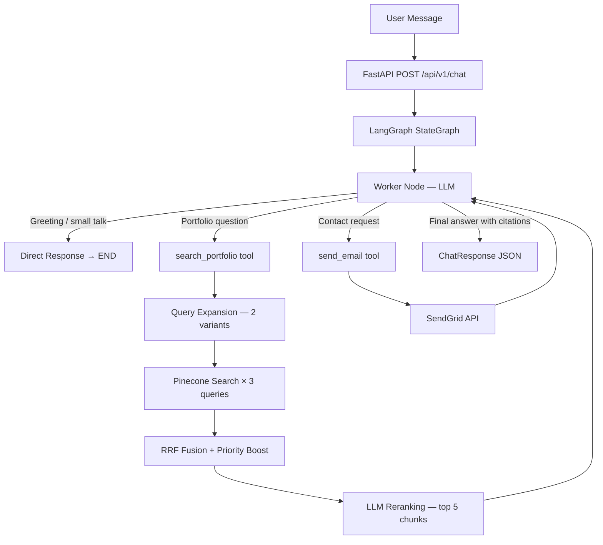

# Portfolio RAG Chatbot


An advanced **RAG (Retrieval-Augmented Generation) chatbot** for [Shashikar Anthoni Raj's portfolio](https://shashikaranthoniraj.netlify.app). Visitors can ask natural language questions about skills, projects, work experience, and education — or send a contact email — all through a single conversational interface.

Built with production-grade RAG techniques: **query expansion**, **RRF (Reciprocal Rank Fusion)** multi-query retrieval, **LLM reranking**, and a **LangGraph** agentic workflow with persistent conversation memory.

---

## Live Demo

Embedded on the portfolio site: [shashikaranthoniraj.netlify.app](https://shashikaranthoniraj.netlify.app)

---

## Architecture



---

## RAG Pipeline — Advanced Techniques

| Technique | Description |
|-----------|-------------|
| **Query Expansion** | LLM generates 2 semantic variants of the user's question to improve recall |
| **Multi-Query Retrieval** | All 3 queries (original + 2 variants) are run against Pinecone in parallel |
| **RRF Fusion** | Reciprocal Rank Fusion merges and re-ranks results from all 3 queries |
| **Priority Boost** | Recent/high-importance documents (e.g., current job) get a relevance boost |
| **LLM Reranking** | A second LLM pass selects the top 5 most contextually relevant chunks |
| **Citation Tracking** | Response includes source document names and relevance scores |

---

## Tech Stack

| Layer | Technology |
|---|---|
| API | FastAPI + SlowAPI (rate limiting) |
| Orchestration | LangGraph (StateGraph + ToolNode + SqliteSaver) |
| LLM | GPT-4o-mini via `langchain-openai` |
| Embeddings | `text-embedding-3-small` |
| Vector DB | Pinecone (serverless, free tier) |
| Email | SendGrid |
| Persistence | SQLite (LangGraph conversation checkpoints) |
| Package Manager | uv |

---

## API Endpoints

| Method | Endpoint | Description |
|--------|----------|-------------|
| POST | `/api/v1/chat` | Send a message, get a response with citations |
| GET | `/api/v1/health` | Health check |
| GET | `/api/v1/graph/image` | Returns LangGraph workflow as a PNG |

### Example Request

```bash
curl -X POST http://localhost:8000/api/v1/chat \
  -H "Content-Type: application/json" \
  -d '{"message": "What projects has Shashikar built?", "thread_id": "session-1"}'
```

### Example Response

```json
{
  "response": "Shashikar has built several notable projects including...",
  "thread_id": "session-1",
  "sources": [
    {
      "document": "projects.md",
      "chunk": "Portfolio RAG Chatbot, Sidekick AI Agent...",
      "relevance_score": 0.95
    }
  ],
  "email_sent": false
}
```

---

## Setup & Installation

### Prerequisites

- Python 3.13+
- [uv](https://docs.astral.sh/uv/) — `curl -LsSf https://astral.sh/uv/install.sh | sh`
- OpenAI API key
- Pinecone API key (free tier works)
- SendGrid API key

### 1. Clone and Install

```bash
git clone https://github.com/ShashikarNEU/portfolio-rag-chatbot.git
cd portfolio-rag-chatbot
uv sync
```

### 2. Configure Environment

```bash
cp .env.example .env
# Fill in OPENAI_API_KEY, PINECONE_API_KEY, SENDGRID_API_KEY, etc.
```

### 3. Ingest Portfolio Data

Embeds all markdown files in `data/raw/` and upserts them to Pinecone:

```bash
uv run python scripts/ingest.py
```

### 4. Run the API

```bash
uv run uvicorn app.main:app --reload
```

- API: `http://localhost:8000`
- Swagger UI: `http://localhost:8000/docs`

### 5. Docker (Alternative)

```bash
docker compose up --build
```

---

## Project Structure

```
portfolio-rag-chatbot/
├── app/
│   ├── main.py                 # FastAPI app, CORS, lifespan
│   ├── config.py               # pydantic-settings (.env loader)
│   ├── api/routes.py           # POST /chat, GET /health, GET /graph/image
│   ├── graph/
│   │   ├── builder.py          # LangGraph StateGraph compilation
│   │   ├── worker.py           # LLM node with bound tools
│   │   └── tools.py            # search_portfolio + send_email tools
│   ├── rag/
│   │   ├── query_expansion.py  # LLM query variant generation
│   │   ├── retriever.py        # Pinecone search + RRF fusion
│   │   └── reranker.py         # LLM relevance scoring
│   ├── services/
│   │   ├── llm_service.py      # OpenAI chat + embeddings wrapper
│   │   └── email_service.py    # SendGrid wrapper
│   └── utils/prompts.py        # System prompts
├── scripts/
│   ├── ingest.py               # Data ingestion pipeline
│   ├── test_rag.py             # Manual RAG pipeline test
│   └── test_graph.py           # End-to-end graph test
├── tests/
│   ├── conftest.py             # Fixtures
│   └── test_api.py             # API unit tests
├── data/raw/                   # Portfolio markdown source files
├── Dockerfile
├── docker-compose.yml
├── pyproject.toml
└── .env.example
```

---

## Development

```bash
# Run tests
uv run pytest -v

# Lint
uv run ruff check .

# Manual integration tests (requires real API keys)
uv run python scripts/test_rag.py
uv run python scripts/test_graph.py
```
